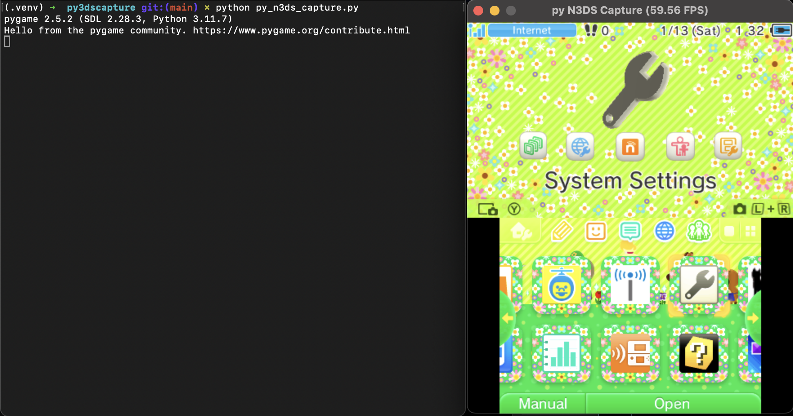

# py N3DS Capture

**py N3DS Capture** is a Python program based on [CuteCapture](https://github.com/Gotos/CuteCapture) for capturing video from an _Old_ 3DS console for linux and Mac OS X with capture cards by [Loopy](3dscapture.com). It uses the libusb library for USB communication and Pygame for display and audio playback.

## Requirements
- Python 3.9 or higher
- libusb 1.0.0
- pygame
- pyusb

## Installation
- Donwload or clone this repository
- Install Python 3.9 from the official [Python website](https://www.python.org/downloads/).
- Install libusb 1.0.0 using the package manager for your operating system.

### For Linux:
#### Debian/Ubuntu-based Systems (apt):
Open a terminal and run the following command to install libusb:

```bash
sudo apt-get update
sudo apt-get install python3.9 libusb-1.0-0
python -m ensurepip --upgrade
```

#### Red Hat/Fedora-based Systems (dnf/yum):
Open a terminal and run the following command to install libusb:

```bash
sudo dnf install python3 libusb
python -m ensurepip --upgrade
```

### For MacOS:
#### Using Homebrew:
If you don't have Homebrew installed, you can install it by following the instructions on the [Homebrew website](https://docs.brew.sh/Installation).

Once Homebrew is installed, open a terminal and run the following command to install libusb:

```bash
brew install libusb
python -m ensurepip --upgrade
```

This will download and install libusb on your MacOS system.

## Usage
If is the first time you need to install the dependencies in the `requirements.txt` file:

```bash
pip install -r requirements.txt
```

Run the program with the following command:

```bash
python py_n3ds_capture.py
```

> **_NOTE:_** You might need to use `python3` and `pip3` instead of `python` and `pip` depending on your intallation.

## Command Line Arguments
- `--log-level` or `-l`: Set the log level in the console to DEBUG, INFO, or ERROR.
- `--manual` or `-m`: Show keyboard shortcuts.
- `--info` or `-a`: Show capture card device info.
- `--version` or `-v`: Show the version of the script.

## Keyboard Shortcuts
- `1`: Scale the window to x1
- `2`: Scale the window to x1.5
- `3`: Scale the window to x2
- `c`: Toggle cropping to the original DS resolution (hold `START` or `SELECT` when launching a game)
- `-`: Decrease the volume
- `+`: Increase the volume
- `m`: Toggle mute

## TODO
- Investigate split-screen feature alternatives. Currently, Pygame does not support multiple windows, so a split-screen feature is not possible.

## Media

